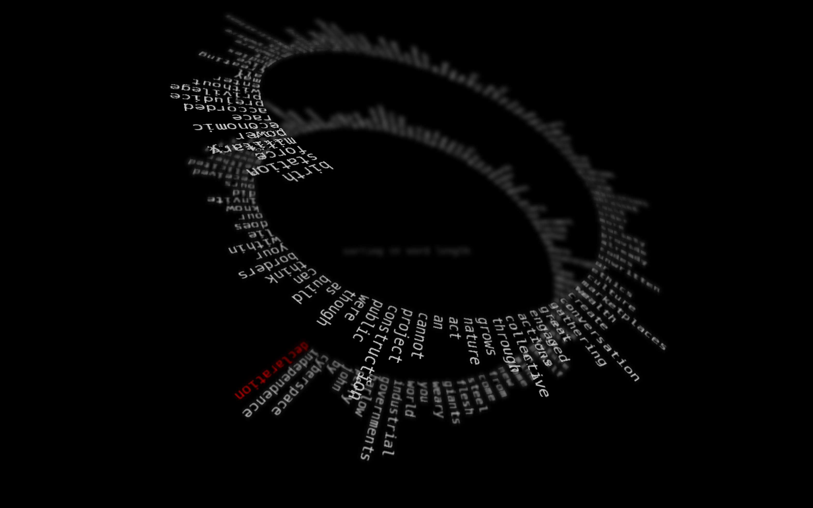
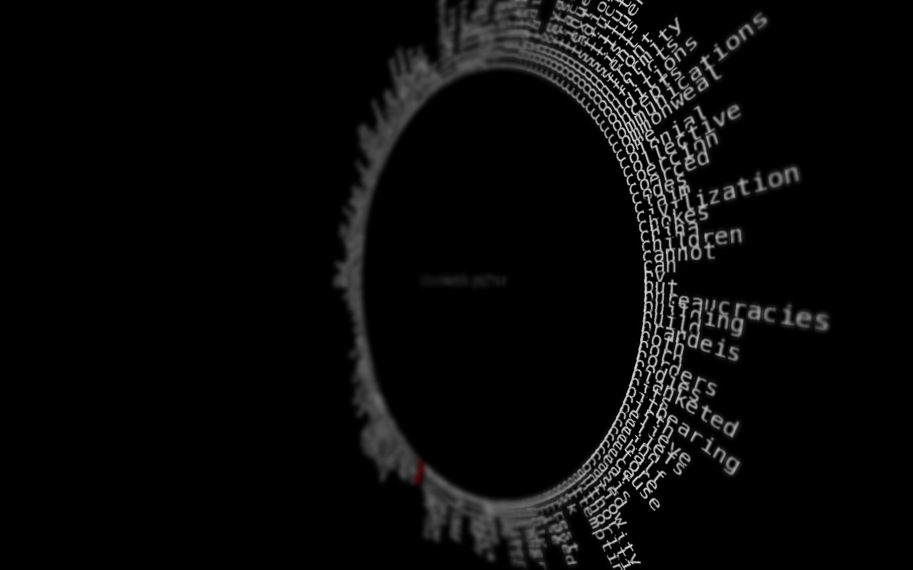

# wordRing
experimental text parser and visualiser, in C++ openframeworks

dependencies ofxDOF  https://github.com/obviousjim/ofxDOF

Instructions for use:

* Press keys from ```1``` to ```4``` to switch sorting algorithms.
* press ```l``` to open file dialog to lad text file from disk
* press ```w``` to load a txt file from the web at a remote url
* press ```b``` to autorotate the circle in 3d
* press ```f``` to toggle fullscreen display
* press up to increase focal distance
* press down to decrease focal distance
* press right to increase depth of field
* press left to decrease depth of field

### Other classes used in this file




